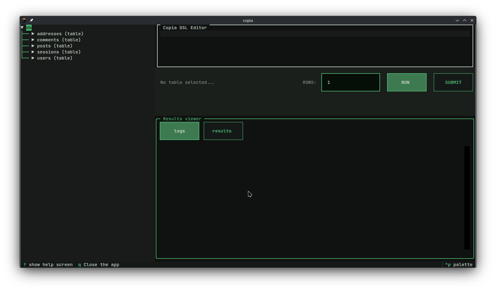
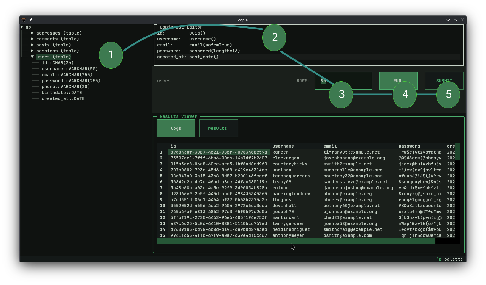
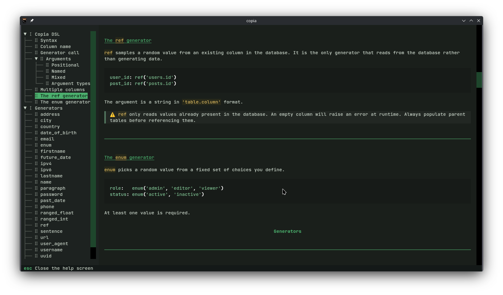

# The TUI

Copia ships with a fully interactive terminal interface. Once launched, everything happens inside the TUI — no extra commands needed.

---

## Layout

The interface is divided into three areas:



```
┌─────────────────┬──────────────────────────────────┐
│                 │  Copia DSL Editor                │
│  Database tree  │                                  │
│                 ├──────────────────────────────────┤
│                 │  Action bar (table, rows, buttons)│
│                 ├──────────────────────────────────┤
│                 │  Results viewer (logs / results) │
└─────────────────┴──────────────────────────────────┘
```

**Database tree** — lists all tables in your database. Expand a table to see its columns and their types. Click a table to select it as the insert target.

**DSL Editor** — write your seed definition here. One line per column, using the Copia DSL.

**Action bar** — shows the selected table, a row count input, and the Run and Submit buttons.

**Results viewer** — displays logs and generated rows. Switch between the `logs` and `results` tabs.

---

## Workflow



### 1. Select a table

Click a table in the database tree on the left. Its name will appear in the action bar. Expanding the table shows its columns and types — useful for knowing which generators to use.

### 2. Write your seed

Type your seed definition in the DSL editor:

```
id:         uuid()
username:   username()
email:      email(safe=True)
password:   password(length=16)
created_at: past_date()
```

Press `?` to open the help screen — it lists all available generators and the full DSL reference.

### 3. Set the row count

In the action bar, set how many rows you want to generate. Defaults to `1`.

### 4. Run

Click **Run**. Copia parses your input, validates it, and streams the generated rows into the results viewer. Switch to the `results` tab to preview the data.

If generation is taking too long, a **Cancel** button appears to stop it mid-stream.

### 5. Submit

Once satisfied with the preview, click **Submit**. Copia inserts the generated rows into the selected table.

!!! warning
    Anonymous columns (columns without a name, e.g. `: uuid()`) cannot be submitted — copia has no way to map them to a real column. Name all columns before submitting.

---

## Keybindings

| Key | Action |
|-----|--------|
| `?` | Open the help screen |
| `Escape` | Close the help screen |
| `q` | Quit copia |
| `^p` | Open the command palette |

---

## Help screen



Press `?` at any time to open the help screen. It contains:

- The full **DSL reference** — syntax, argument types, examples
- The **generators reference** — every available generator with its signature, parameters, and return type

Press `Escape` or `q` to close it and return to the editor.